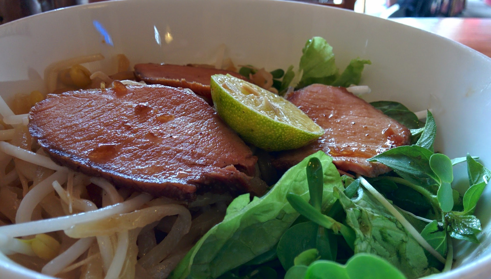
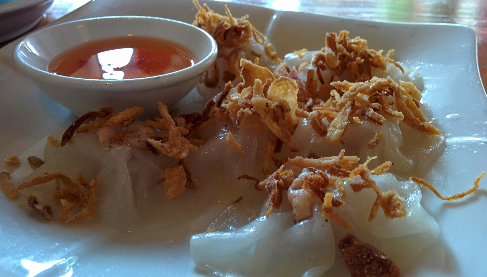

 Trip Nguyen Restaurant Cafe (ranked #123 out of 412 restaurants on TripAdvisor) serves many Vietnamese dishes

We walked into this place on a whim as we seen many other travellers eating and drinking there. Ordering a few plates for lunch we ordered White Rose, Cao Lầu, and Chicken Rice - all Hoi An's specialities.

This quick introduction into Hoi An's flavours that are delivered very cheaply. The flavours and portions are very good instantly making me fall in love with Hoi An food.

I would recommend checking this place out for the cheap local dishes, food is prepared well and for 2 or more people is a great way to trial the local specialities.

> [Trip Nguyen](https://plus.google.com/111909047415655090515/about), 736 Hai Bà Trưng, Minh An, tp. Hội An Quảng Nam, Vietnam‎ Tel: [+84 91 769 31 52](tel:+84917693152) Email: [tripnguyen\_207@yahoo.com](mailto:tripnguyen_207@yahoo.com)


  {{}}
  {{}}

