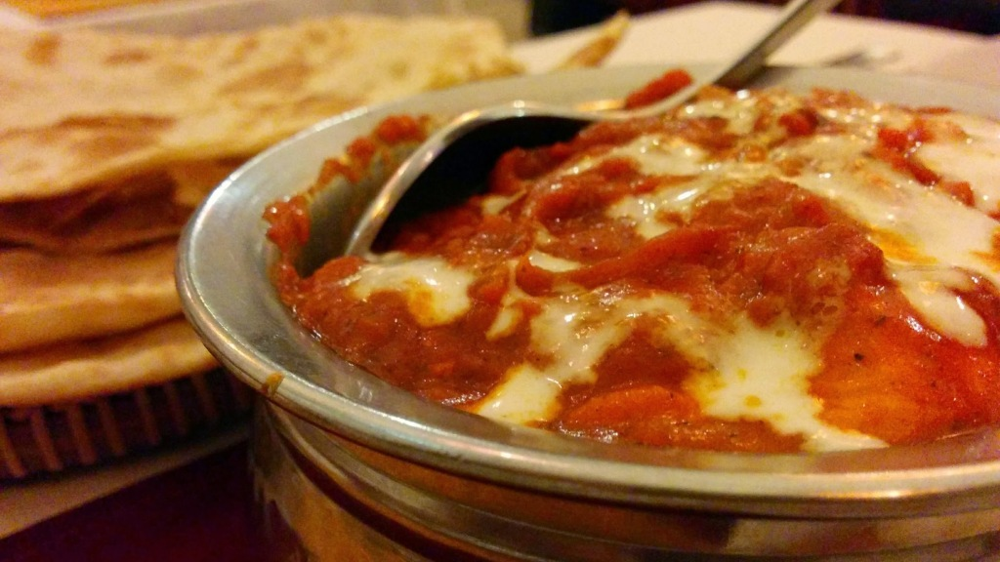

Namaste - Omar's Indian Restaurant (rated #5 out of 412 restaurants in Hoi An on [TripAdvisor](http://www.tripadvisor.com/Restaurant_Review-g298082-d5999031-Reviews-Namaste-Hoi_An_Quang_Nam_Province.html)) that serves a good selection of dishes from all over India.

We walked in around 6pm and the place was empty, (but not for long) by time we ordered more customers were seated. The place was completely full within an hour and customers had to be turned away, there is a reason for this.

We ordered Vegetable Samosa and Chicken Tikka Pieces for a starter, and a Chicken Tikka Masala for our main. Every dish delivered true flavours and spice which completely complements Hoi An's food quality.

As this place will get busy for the food is irresistible, be sure to arrive early to avoid disappointment.

Since visiting, Namaste has moved to a new property 1.2km along Trần Hưng Đạo from the last location. I am without doubt the owners will continue to deliver quality flavours.

> [Namaste - Omar's Indian Restaurant](https://plus.google.com/117383241225773541789/about), 441 Trần Hưng Đạo, Sơn Phong, tp. Hội An, Quảng Nam, Vietnam Tel: [+84 934 988 674](+84934988674) Email: [namastehoian@gmail.com](mailto:namastehoian@gmail.com) Website: [www.namaste-hoian.com](http://www.namaste-hoian.com)
