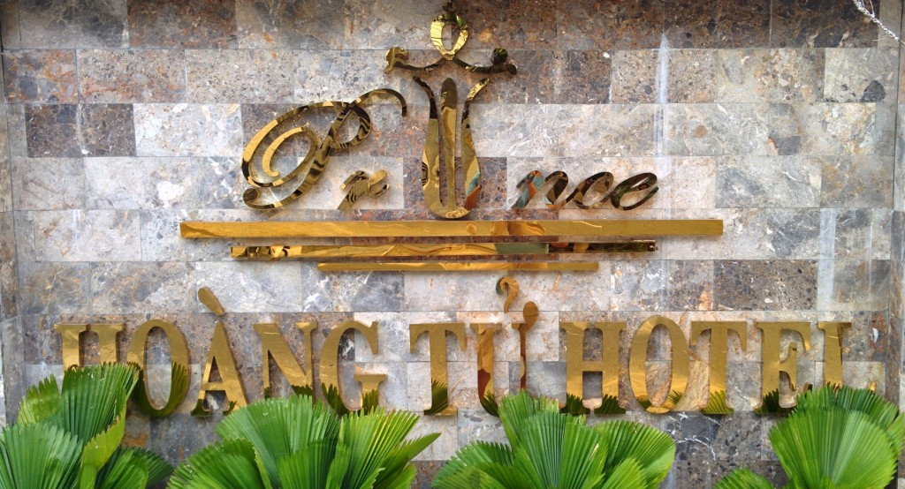
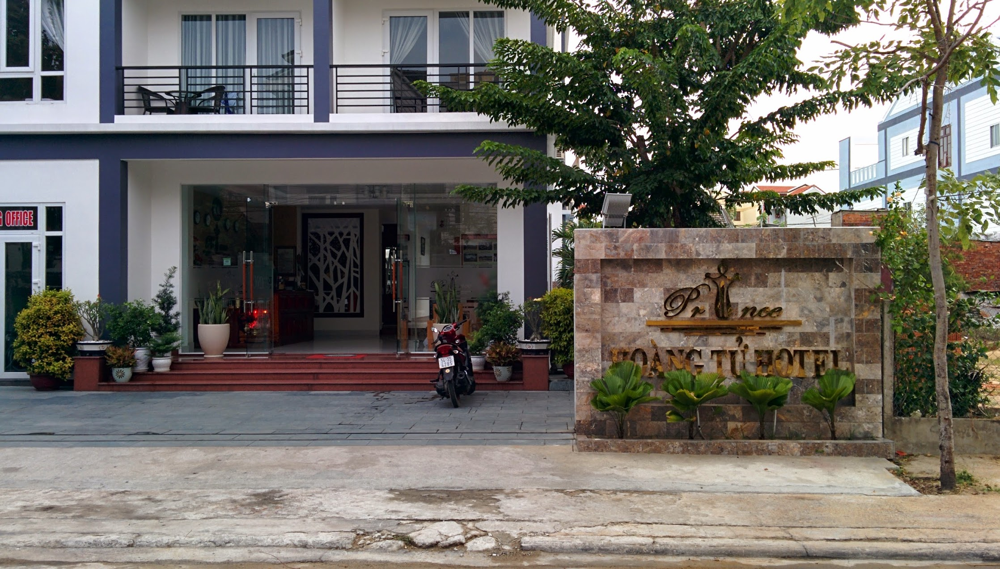
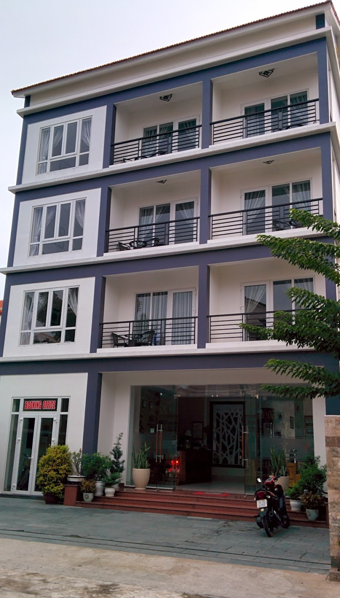
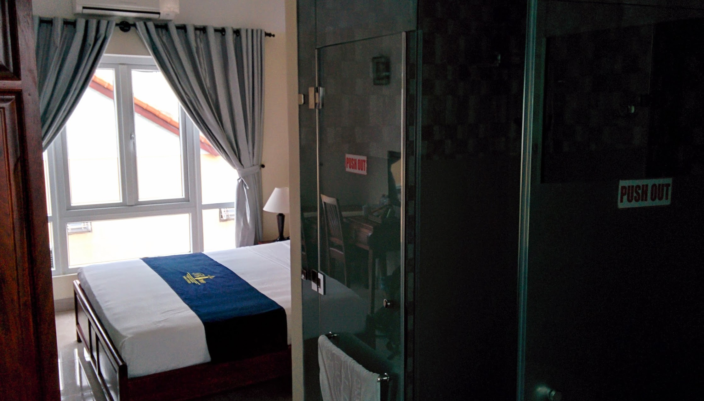
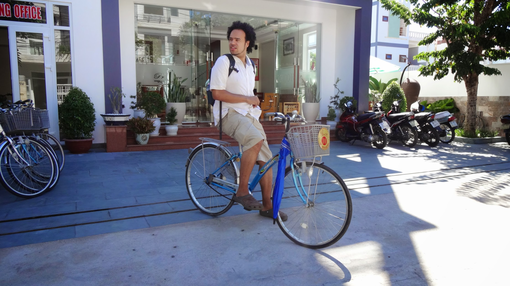

Prince Hotel (ranked #39 out of 110 B&B's in Hoi An on [TripAdvisor](http://www.tripadvisor.com/Hotel_Review-g298082-d5890326-Reviews-Hoi_An_Prince_Hotel-Hoi_An_Quang_Nam_Province.html "Prince Hotel on TripAdvisor")) is a fresh hotel 1km away from the city centre of Hội An.

The hotel has a small swimming pool, bicycle rental and is located in a quiet area of Hội An.

The staff are friendly and always willing to help guests with plans, they do ask a lot about your onward travel plans to see if they are able to help and book travel tickets.

Breakfast is À la carte giving a few choices of food and drinks, it is consistent and served with fresh banana, and hot green tea. - try the 'healthy breakfast'.

The rooms are a modern spacious design with frosted glass shower and toilet rooms - saves wasting space on walls. The bed is soft, air conditioning is powerful and TV has great reception.

We did have to change rooms once because the air-conditioning unit started leaking - I figure some problems may arise with a new hotel.

The city centre is a short cycle away as is the beach, both directions are calm and easy to navigate. There are  spa's and restaurants within walking distance, they are quiet and treat you kindly as tourists are infrequent I these parts for now. - the story could be different in a few years as new properties are opening around this area.

I would recommend this hotel.

Pros

- Free bicycle hire
- Spacious modern rooms
- Decent price
- Friendly non pushy happy staff
- Good distance from city and beach

Cons

- Low water pressure for
- Slow internet speeds

\[usrlist Food:4 Service:4 Room:5 Value:4 English:3 Overall:5\]

> [Hoi An Prince Hotel](https://plus.google.com/113986207819421156995/about), 201 Lý Thái Tổ, tp. Hội An, Quảng Nam, Vietnam Tel: [+84 510 3927 878](+845103927878) Email: [hoianprincehotel@gmail.com](mailto:hoianprincehotel@gmail.com) Website: [hoianprincehotel.com](http://hoianprincehotel.com/)


  {{}}
  {{}}
  {{}}
  {{}}
  {{}}

