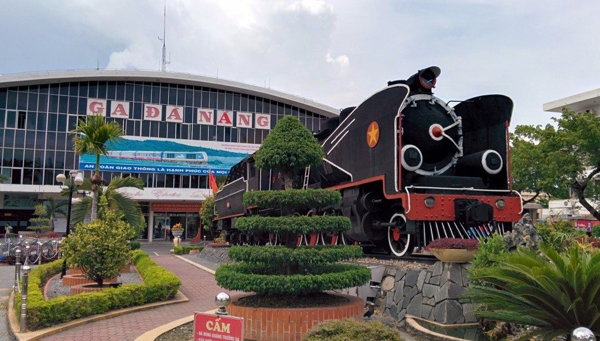

We stayed in Da Nang for a 2 nights in [Olina Hotel](http://gonetraveling.me/2014/09/olina-hotel/ "Olina Hotel") before catching the next 14+ hour train to Nha Trang. The city is spacious with many roads built waiting for properties to be built on them (future fetched), the highly of Da Nang would be the colourful bridges at night. Each night the bridges would illuminate with colourful light displays.

We took a quick walk to the beach but did not stay for long as a storm was working its way in. Instead we decided to walk the 3.5km to the city working up an appetite for a coffee and food later that evening.

We ate at a busy BBQ place called [Quan Com Hue Ngon](http://gonetraveling.me/2014/09/quan-com-hue-ngon/ "Quán Cơm Huế Ngon"). You can rack up a large bill of small but delicious entries to cook on your very own BBQ, some interesting flavours, but sadly small portions.

We got the train from Da Nang to Nha Trang our next destination, using the local train station was really simple. A great way to avoid commission charges for travel agents to get your tickets. (We did spend a while looking for the entrance to the station tho)

Anyway enjoy these photos.

\[gallery link="file" type="rectangular" ids="1351,1352,1353,1354,1355,1356" orderby="post\_date"\]
