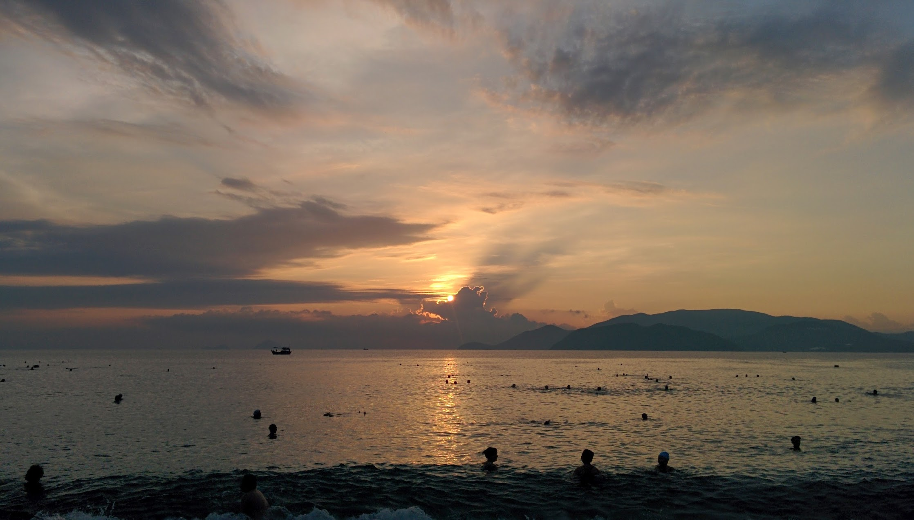

The is the beach capital of Vietnam, with a long beach span that makes watching the morning sunrise magical. Many travel goers flock to this beach with its high-rise resorts right along the coast line, most residents are within a short walk from the busy beach.

We arrived via Train from Da Nang, the journey was very painless and not as eventful as the Journey from Hanoi to Hue. Upon arriving we took a taxi (as always with Maylin) to our hotel Golden Sea Hotel, unfortunately we was met with friendly staff which turned hostile when they insisted we pay before staying or forfeit out passport (something we have not had to do in the North of Vietnam). We immediately canceled the booking and walked around the corner to check if our backup hotels had vacancies, we choose to stay at Summer Hotel for 1 night (as it was already past 9pm). The next day we found a cheaper hotel [White Lion Hotel](http://gonetraveling.me/2014/09/white-lion-hotel/ "White Lion Hotel") just behind Summer Hotel which is pleasant enough and keeps the costs down.



We made the effort to wake up before sunrise and observe the sunrise across the South China Sea (as the sun rises from the East). It was wonderful sitting there watching the morning events, locals coming to the beach for a early morning swim - and then burring themselves in sand (could not understand, but they where happy doing so) I even decided to go for a [run along the beach](http://runkeeper.com/user/MeKyle/activity/440614401) as the air was cooler.

**Food** Some notable places we ate at; [Pita](http://gonetraveling.me/2014/09/pita-gr-restaurant/ "Pita GR Restaurant") (a greek restaurant that serves Souvlaki), and [Lanterns](http://gonetraveling.me/2014/09/lanterns-vietnamese-restaurant/ "Lanterns Vietnamese Restaurant") (Vietnamese food). Both unbelievably great tasting places. You should eat at these places.

Nha Trang is worth a visit because the beach is full of life, but would not desire to stay in Nha Trang for very long. The cost is slightly inflated as it is a very popular tourist destination, and there is quite a bit of hostility because of that.


  {{}}
  {{}}
  {{}}
  {{}}

