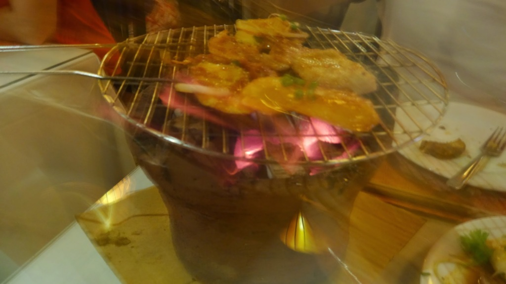

 Lanterns is a Vietnamese restaurant (ranked #2 out of 421 restaurants in Nha Trang on [TripAdvisor](http://www.tripadvisor.com/Restaurant_Review-g293928-d1515355-Reviews-Lanterns_Vietnamese_Restaurant-Nha_Trang_Khanh_Hoa_Province.html)), it serves a good choice of popular Vietnamese dishes, most impressive choice would be the BBQ. Choosing a choice of meats to be cooked on your very own BBQ at your table makes an interesting experience. The meat is nicely marinated before it is brought to the table. The food is of great quality and the service is friendly and talkative that complements a comfortable atmosphere.

Worth the visit.

> [Lanterns](https://plus.google.com/103059702242976874468/about), Nguyễn Thiện Thuật, tp. Nha Trang, Khánh Hòa, Vietnam Tel: [+84 58 2471 674](tel:+84582471674) Website: [lanternsvietnam.com](http://lanternsvietnam.com/)
