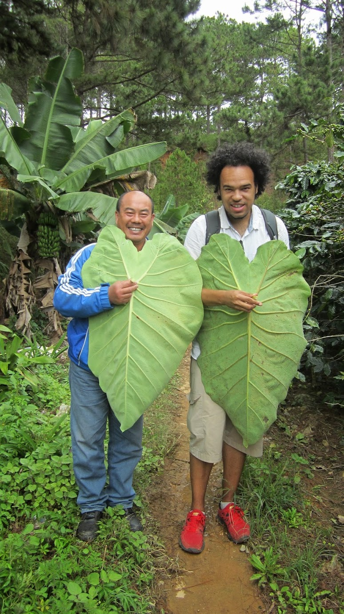
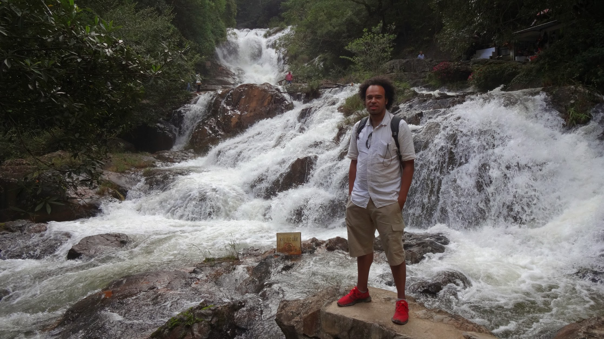

We visited Đà Lạt the capital of Lâm Đồng Province in Vietnam. Dalat with an altitude of 1500 it is much cooler than other towns and cities we visited in Vietnam. Its a popular off-track tourist destination that requires a small bus to twist and turn around tight Mountains roads and uneven surfaces.

We stayed at Tulip Xanh Dalat Hotel, which the staff are nice but the sleep quality is not so good due to light and noise. The hotel is beside a main road which has traffic day and night. The large thin windows allow street lights to illuminate the room with a constant orange glow, and the noise from struggling motorcycles going up the hill makes for a broken sleep night. Until the hotel get blackout curtains and infest in sound proof windows I would only recommend a short stay here if on a budget, for $9 per night not a lot was expected.

The food of Dalat did not impress me, the thought that a lot of crop is grown here gave me a high expectation of quality. Sadly all the restaurants rated highly on TripAdvisor did not please me. I regularly publish reviews and feedback about restaurants, hotels and attractions on TripAdvisor as they help me choose where to eat and stay from other customers who have stayed. There happened to be one incident where I drafted a review expressing my feedback for the place while waiting for a bill in Da Quy. The review was prematurely published, this resulted in the staff confronting me in the street asking to cook me another meal or give me something to change the review. I give honest reviews, if something is not right I will endeavour to provide the feedback so it can be improved. I explained this to the staff and explain I can not change my review because there is improvement to be made and it would be dishonest to other guests who expect something that is not truth. TripAdvisor allows other customers to get a gist of the experience they may receive and allows business owners to gain curtail feedback, managers can respond to reviews to give a rounded perspective. In only extreme circumstances where a business owner has been able to go far and beyond to improve my persecution will I re-review.

**EasyRider Tour**

While in Dalat we decided to take a EasyRider motorcycle tour around surrounding villages.

**Dalat Rail Station** A quick stop at Da Lat rail station which was designed by French architects Moncet and Reveron. The rail line is disconnected from the mainlines and only has a 7km stretch to take tourists back in time to 1930s. Did not ride the line but just enjoyed seeing a steam locomotive up-close and personal.



**Plantations** Following Dalat rail station our guides taken us along the hills to overlook the valley and sorrowing mountains, past coffee plantations and to a tea plantation high in the clouds. Coffee trees are seeded anywhere there is space, we stopped by some trees that are planted by a disused rail tunnel that still shows battle scars from the Vietnam War. The coffee beans are not ripe at this time, so the beans are still green. Coffee beans turn red when ripe to pick, there are 2 outer shells before the raw bean we use for coffee. Coffee is a big thing in Vietnam coffee stores can be found everywhere, they mix many types of beans together to make a strong blend and serve it with condensed milk hot or cold, the result flavour would be a strong sweet almost chocolate coffee flavour. The tea plantation gave the most distinct aroma I would simply describe as long brewed english tea (like in tea cafe’s where old Betty goes for her chip butty). Rows upon rows of small hip-high stress of tea that would be picked each morning for the leaves. Da Lat is a main agricultural town, many covered greenhouses claim every bit of land, they grow almost everything, but impressively the scale of flower cultivation is popular.

We enjoyed a local lunch with our riders, a great deal of rice with seasoned pork, mackerel fish and chicken. It was a treat to try local food with good company.

**Lake and Elephant** The day finished on the biggest high, a ride to Hồ Tuyền Lâm a man-made lake flooded to allow the control of a possible hydro electricity plant and/or flood prevention (I assume). Beside this lake a small retreat where visitors can sit overlooking the lake, we enjoyed the sunset. Really peaceful and quiet, I would think this location be much busier in the years to come.

I could not forget to mention, in this little corner of paradise we met Blu - a female elephant. Blu is the first elephant I have seen and touched up close. She came over and greeted us (seeing if we have some sugar cane or fruits). She also serves as an attraction (which I appose, I love these creatures and would not like to see them abused for tourist gain) but also a local pet/family member. She did have freedom to roam, which she cleverly expressed when we prepared some sugar cane to give her on our way back. She had smelt the cane and came on over, devouring it before our return and facing the wrong way with little room to manoeuvre (She stood there like a naughty child). We had to move her back to her spot (with a little help from me) so she would not damage the nearby shacks. Her master hurried her up waving a stick, she made a wailing noise to express she was not happy and did not like the stick (I assume she could have been hit before). When she got back to her spot we treated her to some more sugar cane, presenting it to her and she would take the cane from us with her trunk - she is very strong at doing so.



The EasyRiders tour made Dalat for me, I really enjoyed visiting the different areas of this town.


  {{}}
  {{}}
  {{}}
  {{}}
  {{}}
  {{}}
  {{}}
  {{}}
  {{}}
  {{}}
  {{}}
  {{}}
  {{}}
  {{}}
  {{}}
  {{}}
  {{}}
  {{}}
  {{}}
  {{}}
  {{}}
  {{}}
  {{}}
  {{}}
  {{}}
  {{}}
  {{}}
  {{}}
  {{}}
  {{}}
  {{}}
  {{}}
  {{}}
  {{}}
  {{}}

