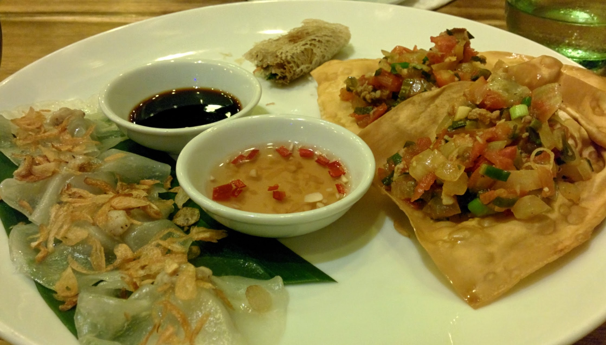
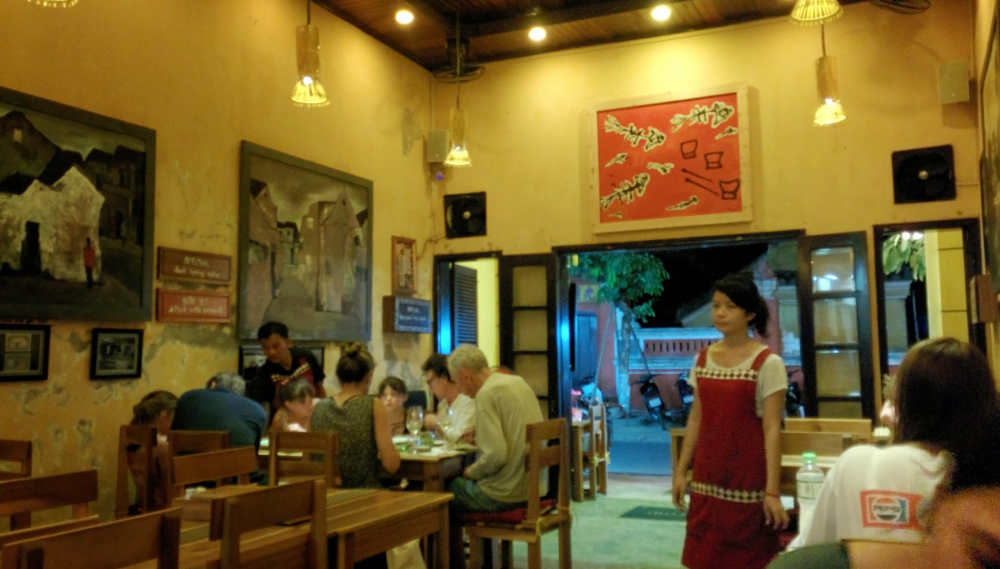
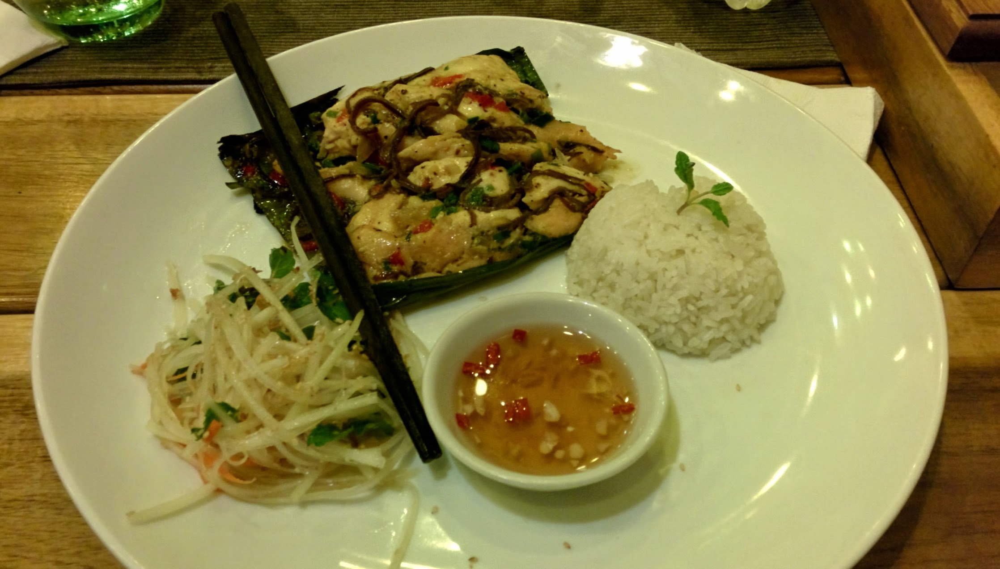
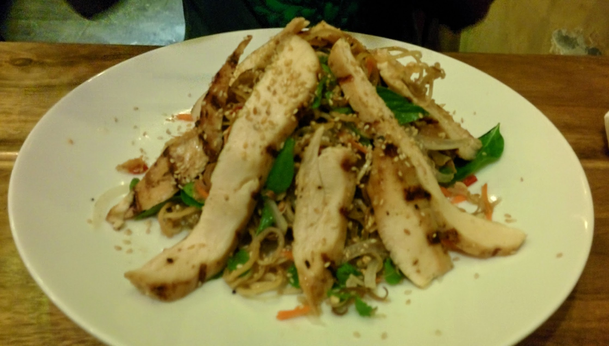

After checking our Lonely Planet book and TripAdvisor we decided to eat at the Little Menu Restaurant  for our first night in Hoi an.

This place has a simple menu with an array of dishes ranging in price. There specials are written up on chalk boards, but they are only rotated seasonally instead of daily or weekly.

We chose Rolls tasting platter, Chicken in banana leaf "special" and Banana Blossom salad with grilled chicken.

The textures in the dishes are great, flavouring is ok. Only slight off part to our dishes were the sweet and sour dip's that were more on the fish source side.

I really liked the banana leaf chicken and the white rose rolls.

Overall, the service if great, food is good and atmosphere is pleasant.




  {{}}
  {{}}
  {{}}
  {{}}

