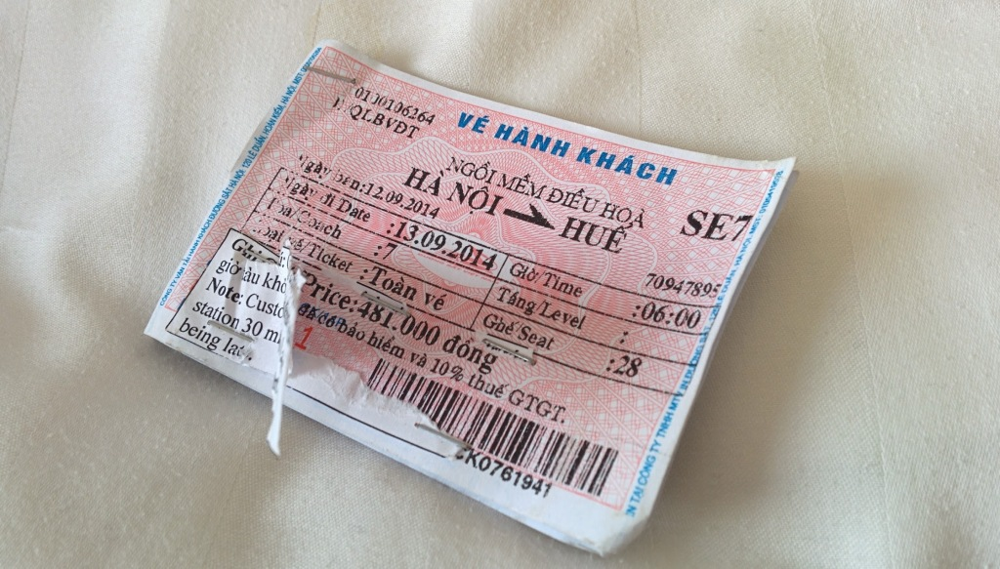
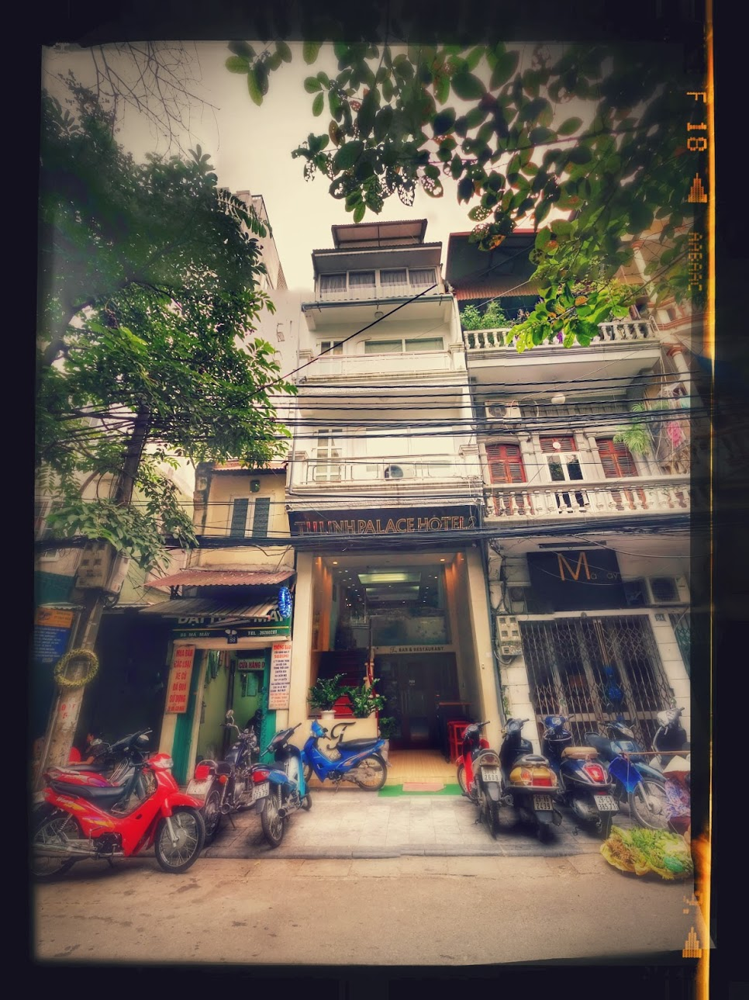
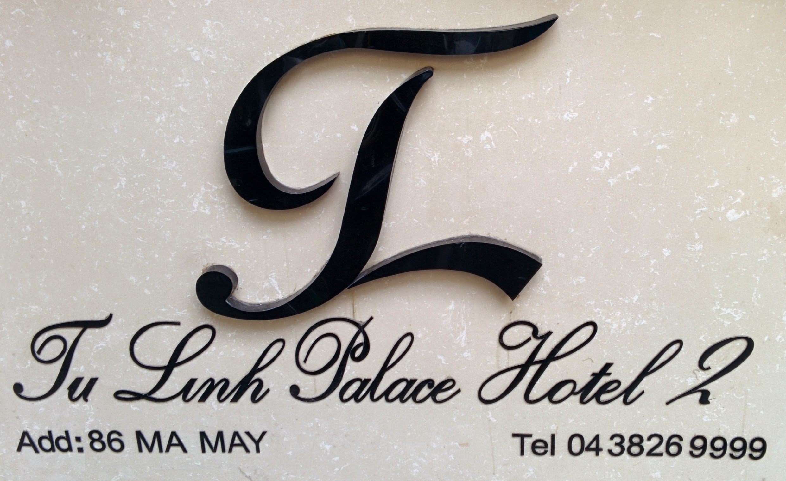
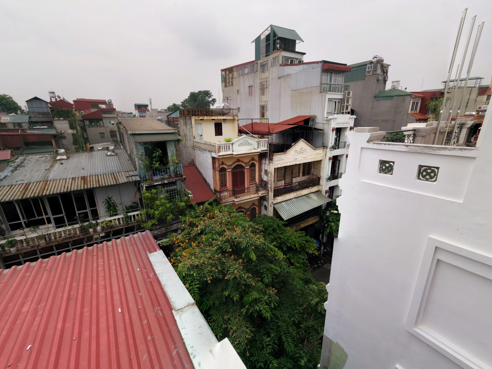
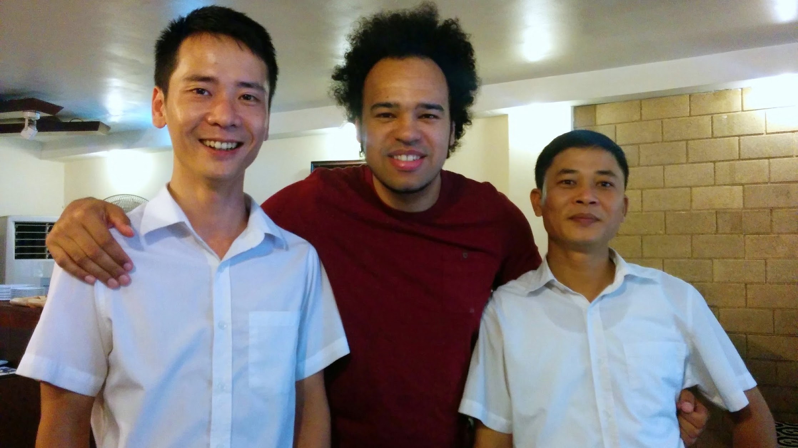
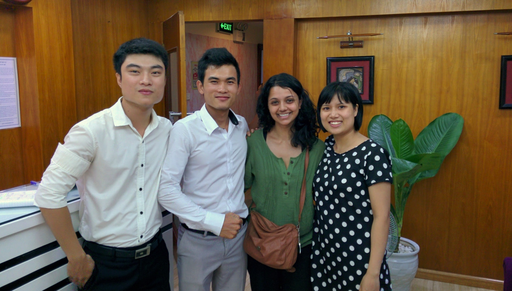
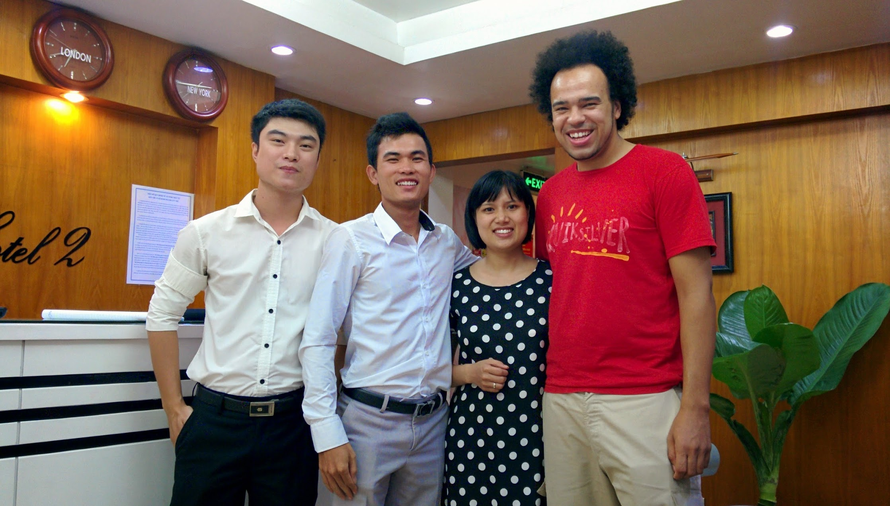
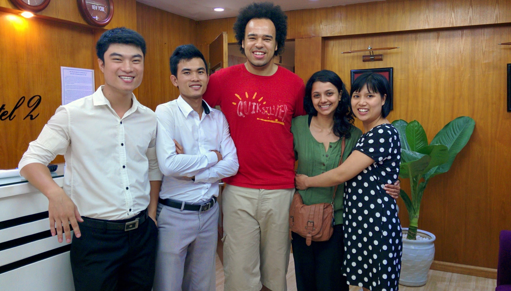

Tu Linh Palace Hotel 2 is in a quiet area of _Hàng Buồm_ - great to escape the night activities. You can walk (or run) anywhere within good time.

The front of house staff _Lilli, Ghang, Thian, and Ming_ at Tu Linh, every morning will greet with smiles saying "Hello, How are you? Did you sleep well?". They are seem genuinely are happy to see you and make the stay in Hanoi good, they are very knowledgeable about places to visit and eat. Ghang when on duty would spend most of his time playing video games, Lilli would make efforts to sell tours, and Thian would await guests and greet them with great enthusiasm, and Ming works the night shift with Te Te, He sometimes can be difficult to communicate with, but is a happy guy to chat with.

The upper (deluxe) rooms are large, clean and comfortable with windows and small balcony overlooking most of the close by roofs. The massive bed with firm mattress and pillows, I did suffer slight back pain some days. Rooms are cleaned and fresh towels are provided most days. The lighting is visually good but the fluorescent strip lights do make a continuous hum that can become unpleasant after a while. The air-conditioning is quiet, cold and welcoming after a hot day walking around the streets. The electricity in the room gets disabled when the key fob is removed, including the air-conditioning and fridge - we used a phone card to keep the electricity on and room cool. The rooms have been decorated a few times and the poor workmanship shows, the bathtubs are an after thought and seem unnecessary. Wall's have been wall-papered, by some mould still is visible though.

There is an elevator that runs from reception to the 6th floor, the 15 steps from street level to reception is a minor inconvenience when our legs become jelly after a long day.

Breakfast gets served every morning with cold cuts of ham, bread, fresh fruit, tea/coffee, and eggs cooked to order - I did become bored of the same selection after a few days, it would have been nice for some yoghurt or fruit juice.

We initially booked a week but feeling relaxed with Hanoi we stayed a little longer, eventually staying 1 month in total. Managed to commit some work, speak with my parents on Google Hangouts, research what to do next and general administration.

We booked our [Sapa](/posts/2014-08-sa-pa/ "Sa Pa"), and [Ha Long Bay](/posts/2014-08-ha-long-bay/ "Hạ Long Bay & Bái Tử Long Bay") tours though Tu Linh and have arranged VISA extensions, train tickets, and an airport pickup. - Gave in to the friendliness and convenience.

I would highly recommend you stay here when in Hanoi. - you will have a great stay.

Our large deluxe room with window cost $28 (£17.25) per night, in total bill came to $1904.60. We paid in Vietnamese đồng withdrawn from the [CityBank ATM](https://www.google.com/maps/place/Citibank+-+Atm/@21.0320635,105.8519147,18z/data=!4m5!1m2!2m1!1sCitybank+ATM!3m1!1s0x0:0x9f7557b4511ed157) to avoid any transaction charges - thats 40,387,000đ (£1,173) in total.

Retrospectively we should have shopped around for laundry and tour services. We realised we were charged $20 commission on our train fair out of Hanoi (the tickets had a stabled label over the original price), charged an extra $1 more per KG of cloths the be laundered, and offered a possibly over commissioned on other tours too. The odd buck here or there might be ok, but it does add up over a course of a month.

Tu Linh Palace Hotel 2 pride themselves for high TripAdvisor reviews and they should, on the outset for the price they are a good hotel. However, the commission up-sell's and lack of loyalty discount did have a negative impact on this view. I spent days after being angry at myself for being lazy using the on-site services and assuming the staff in giving a friendly price, it cost me more than it should - the though of _being ripped-off with a smile_.

Pros:

- Great location
- Reasonably priced
- Friendly Staff
- Good fast WiFi is mostly available
- High pressure Hot Water

Cons:

- Limited breakfast variation from day to day
- Complementary room water is not restocked
- 3% credit card transaction fee (if you pay bill on card)
- Outrageous commission
- Lack of loyalty discounts for long term guests

<!-- \[usrlist Service:4.5 Rooms:3.5 Food:3 Value:3.5 English:4 Overall:3\] -->



<!-- You can book on [Agoda](https://www.agoda.com/tu-linh-palace-hotel-2/hotel/hanoi-vn.html?cid=1649959), [Booking.com](https://www.booking.com/hotel/vn/tu-linh-palace-2.html?aid=399308) or Directly. -->

<!--  -->

<!--  -->


  {{}}
  {{}}
  {{}}
  {{}}
  {{}}
  {{}}
  {{}}

