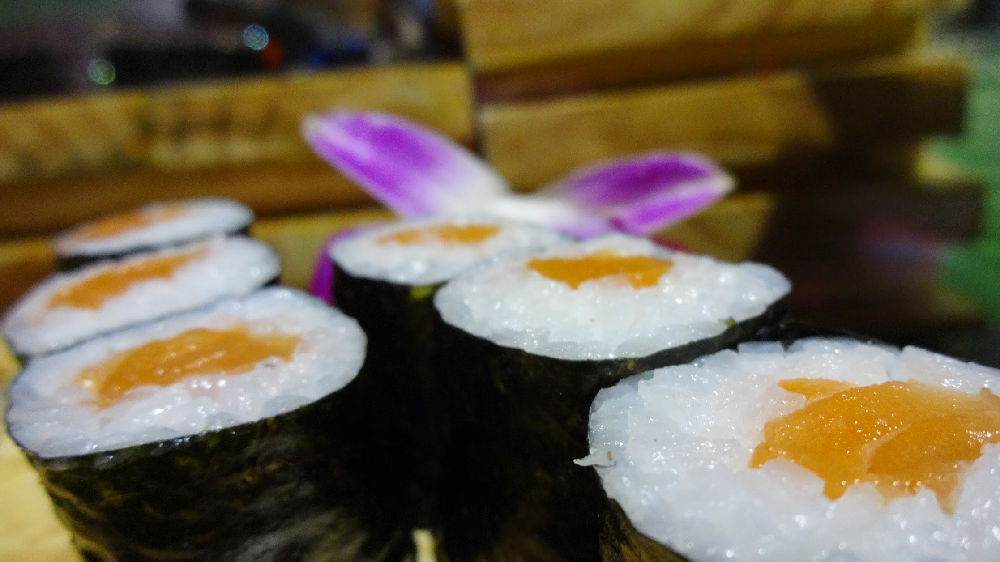
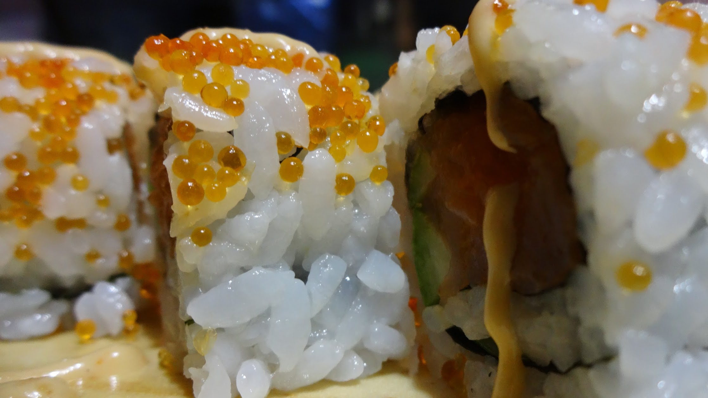
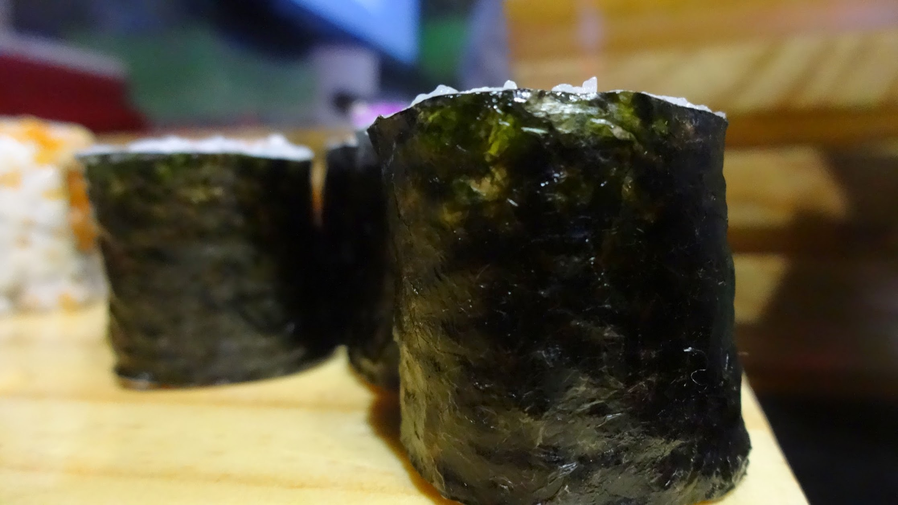
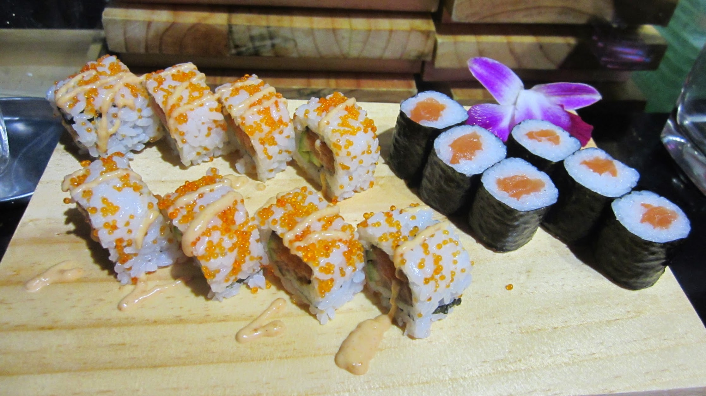
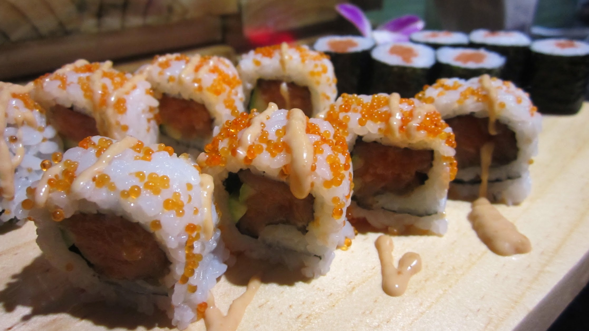
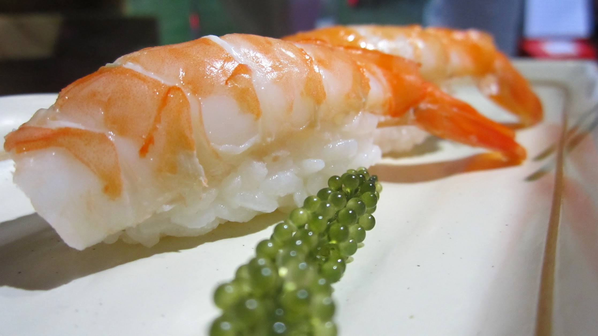

Ichiban Sushi  rightfully ranked #1 for its attention to detail.

We stat at the bar and ordered form the wide array of delicious looking dishes, Shrimp, and Salmon Nigiri. As we waited for our dishes to arrive, we watched the skilled Sushi chef’s carefully prepare the the many dishes that are printed up on a large LCD screen above. All the food looked really stunning.

Our nigiri arrived about 40 minutes from ordering, seemed much less as it was very interesting watching the chefs. I enjoyed every byte, savouring the flavours and enjoyed conversation with my partner. This being my first fresh sushi bar experience, I am very impressed. Even tho we only ordered two dishes, it was very filling and had to ask the waiters to package our left-overs for home.

I would love to visit again.




  {{}}
  {{}}
  {{}}
  {{}}
  {{}}
  {{}}

