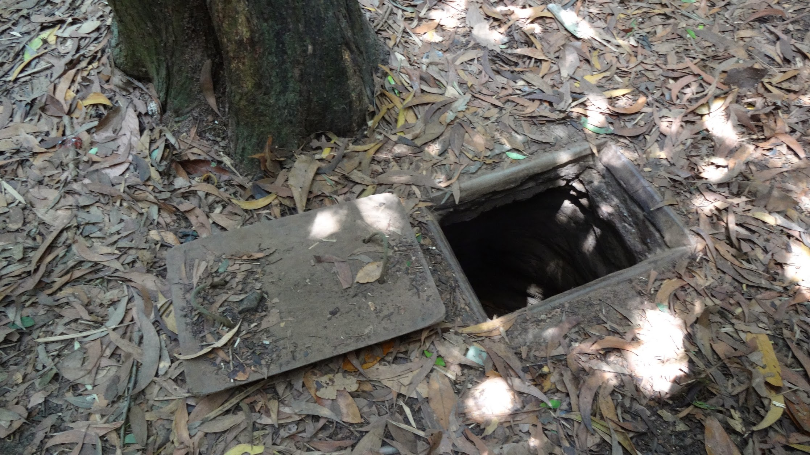
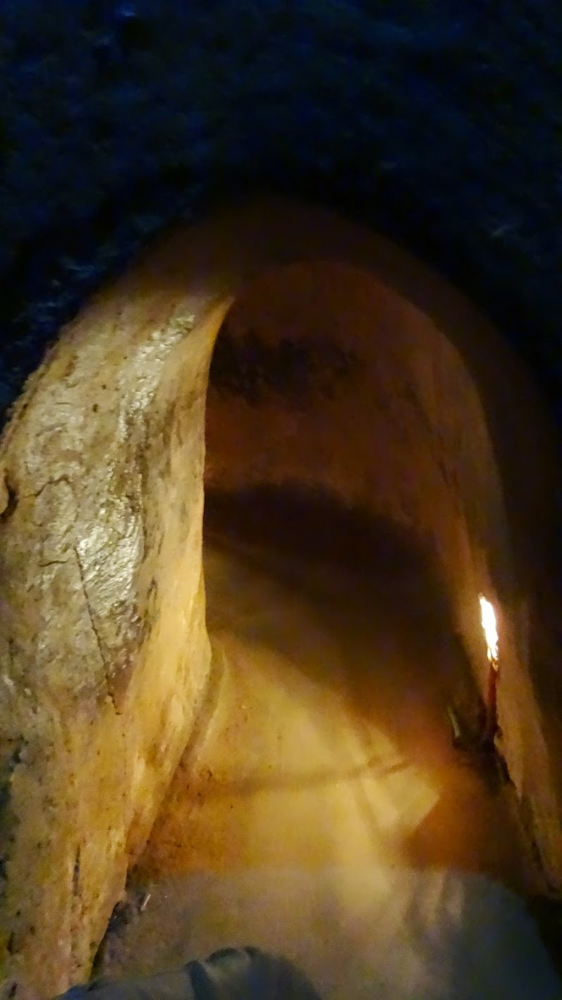
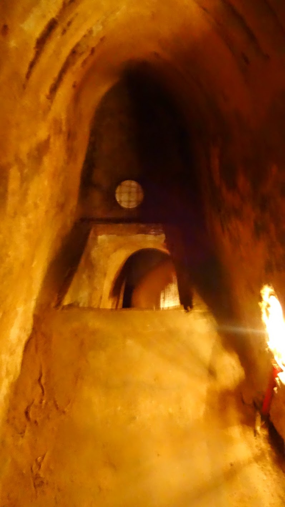
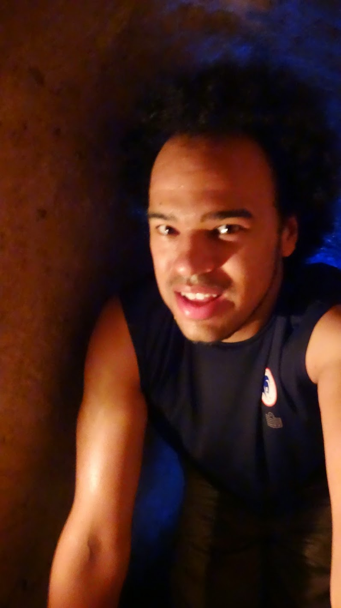
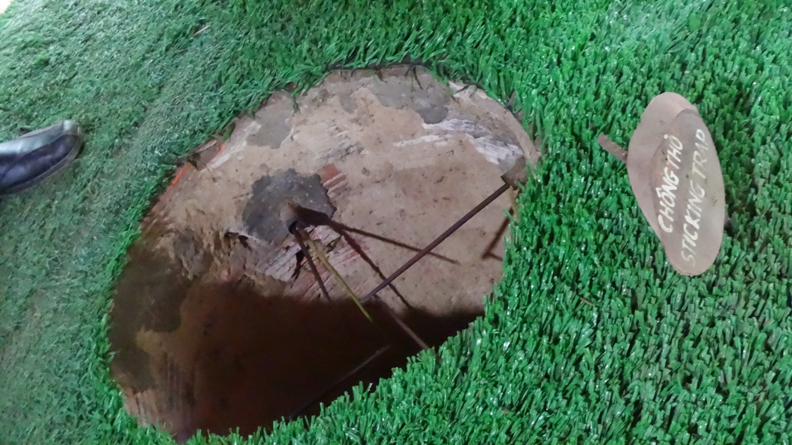
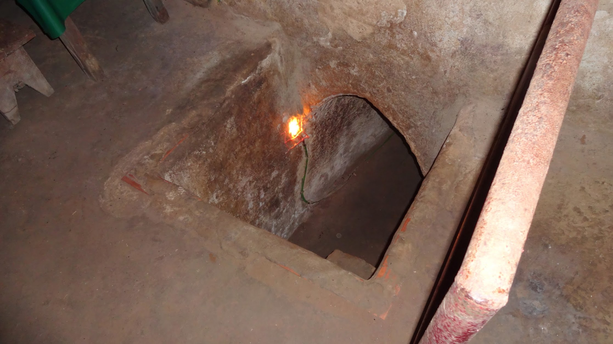

The tunnels of Củ Chi  are a network of connecting underground tunnels used during the Vietnam war.  The locals would live under group and defend their land.

I booked the tour via [TheSinhTourist](https://www.thesinhtourist.vn/tour/sg/to-sgcc-01/cu-chi-tunnels-half-day) at the same time as booking onward tickets to Cambodia. The Củ Chi Tunnels cost 109,000VND for half a day with a tour guide and entry.

It is really useful having a guide explain to you all the details about the tunnels, traps and history of what happened.

I crawled the tunnels, and when I popped out the other side my entire tour group including Kim had disappeared.




  {{}}
  {{}}
  {{}}
  {{}}
  {{}}
  {{}}
  {{}}

