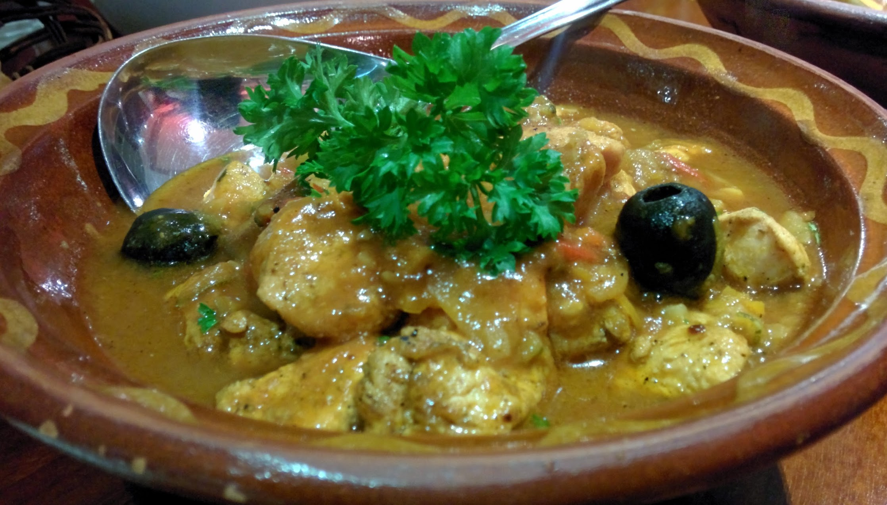
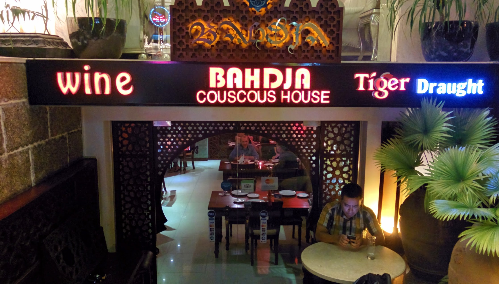

I visited Bahdja Restaurant with some friends, treating all of us to a cuisine non of us have ever experienced, Algerian (North African) Food.

It was a little difficult to find as there was no major signage that made it obvious to spot. It’s tucked away under a hotel. The place only has 6 tables to cover, and we where lucky to be seated. The decoration makes for pleasant relaxation while browsing the minimal but concise menu.  Drinks are served with pride, the mint tea is very fragrant, sweet and delicious, a must have. Along with the food, you can order, chicken, lamb or sausage, or if you’re really hungry, all three.  - I was not that hungry sticking to just Lamb.

Before the main’s came out, we ordered a basic starter for the table, olives and dips with warm bread. The only suggestion I would have is to serve olives with the pips, they retain more flavour that way. We all enjoyed the little appetisers anyway.

With little time to rest, the main’s started to come out, I forget the names, but two of us had a curry type dish with meat and vegetables - A warming subtle dish that is not spicy or over accented. I had 3 succulent rib’s of lamb, with plenty of meat with plenty of african gravy and couscous.

Only unsettled part would be the service, it was good, but not excellent. The (what I assumed) manager has a very stern accent and delivery which is a little confusing at first. I can sense some stress with ensuring everything is brilliant.  Might have just been a off day, or I must have interoperated her wrong.

Either way, I really enjoyed the flavours, and atmosphere. I would love to return again and hope the place keeps up their great work.




  {{}}
  {{}}
  {{}}

