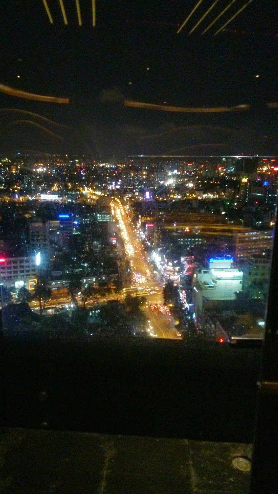
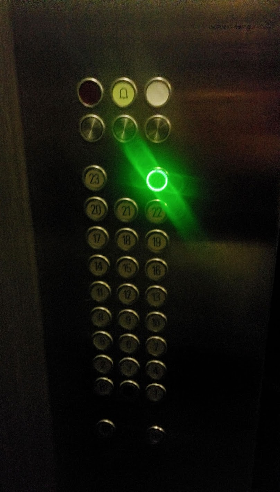
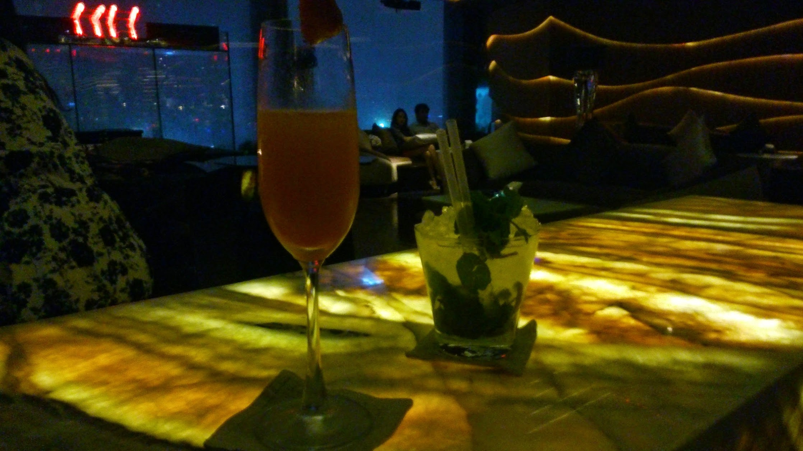
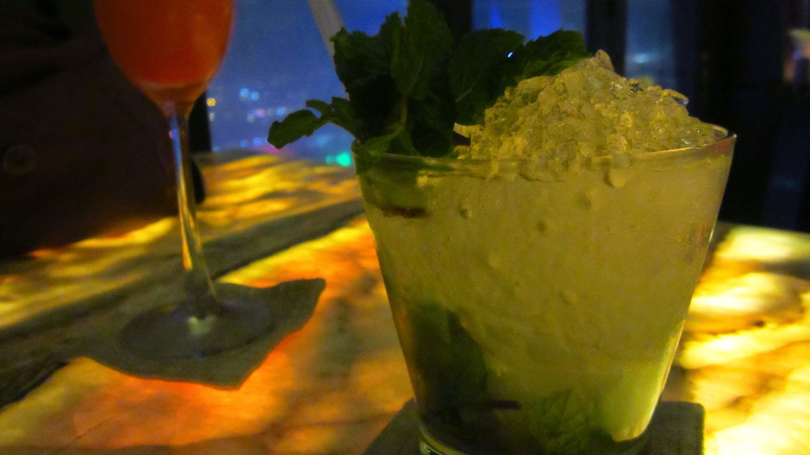

As there are many high rise buildings around a visit to view the city scape in the night could not go a miss.  I decided to go Chill Skybar (Ranked #7 out of 48 Nightlife in Ho Chi Minh City on [TripAdvisor](http://www.tripadvisor.com/Attraction_Review-g293925-d2336225-Reviews-Chill_Skybar-Ho_Chi_Minh_City.html)).

Thinking I would not be allowed to enter with a my traveling t-shirt and shorts, I was not questioned once.  The staff treated us with quality service, like we’re celebrities.  Above this, the drinks are not cheap outside of happy hour, but they are made with good care too.  The atmosphere of the place with its lounge house music and soft lighting makes a comfortable viewing and relaxing experience.  Unfortunately during our visit, it had rained earlier and staff would not allow us out onto the deck to take a view without glass between us.




  {{}}
  {{}}
  {{}}
  {{}}

