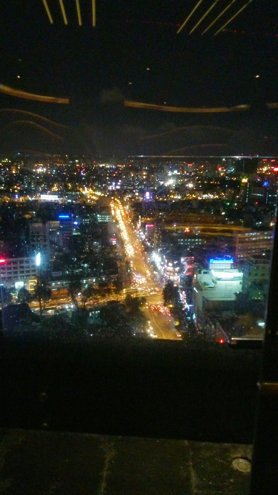
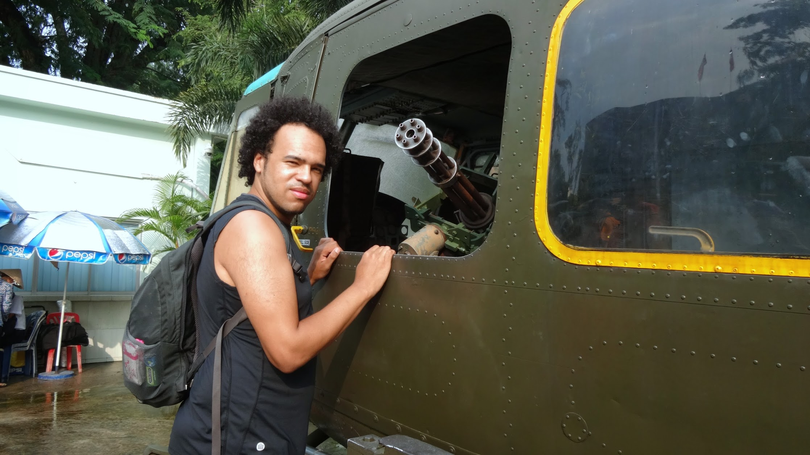

Ho Chi Minh City was our last stop in Vietnam, we stayed in a [Cheerful Home in Siagon that’s listed on AirBnB](https://www.airbnb.co.uk/rooms/3864609) for 1 week and our hosts made us feel very much at home. Most days we spent walking around the city, eating good food, and gathering last bit’s of souvenirs of Vietnam before we leave.

{{}}

Ho Chi Minh City formally named Siagon is the largest city in Vietnam with a population of over 8 million residents. The roads and streets are filled with motorcycles, cars, and busses. Most of the roads are one way, but it does not stop some determined cheeky motorcyclists using the pavements as an exclusive reverse direction road, beeping at pedestrians to get out-of-the-way - no where is safe from the motorcycle!

**Things to do**

{{}}

We did one night invite our hosts out for a meal at Bahdja and some [Jazz at Sax n Art Jazz Club](http://gonetraveling.me/2014/10/sax-n-art-jazz-club/). A day at [Củ Chi Tunnels](http://gonetraveling.me/2014/10/cu-chi-tunnels/), Day in the [war remnants museum](http://www.baotangchungtichchientranh.vn/) and a drink in [Chill Skybar](http://gonetraveling.me/2014/10/chill-skybar/ "Chill Skybar").

**Food in Ho Chi Minh City**

{{}}

While in Ho Chi Minh City we did gorge out a bit, we had Mc Donnald’s, Burger King, and even Starbucks Coffee.  Visiting these chain properties gave us a sense of being back at home for a moment. It has been months since we’ve had any thing that we take for granted back in the United Kingdom.

We did not eat at the popular chains every day, we did make the effort to check out some other highly rated independent restaurants. We had Sushi served with great discipline at [Ichiban](http://gonetraveling.me/2014/10/ichiban-sushi/), experienced African food at [Bahdja](http://gonetraveling.me/2014/10/bahdja-restaurant/) enjoyed the most flavourful clay oven pizza at [Pizza 4P’s](http://gonetraveling.me/2014/10/pizza-4ps/), and tried the local Vietnamese dish Cơm Tấm just down the road from where we was staying.  We ate good!

**Shopping in Ho Chi Minh City**

{{}}

When in Ho Chi Minh City, do visit Ben Thanh markets. These markets have all the tourist souvenirs you’ll find throughout the country and because there is so many vendors it is easy to bargain a good price or move onto the next person who will honour your price. Take a notepad, on the outer ring are fixed price stalls, you can note the prices of things you like the look of then go into the middle main part to haggle a better price, this way you will defiantly pay best price or as locals say “Cheap cheap”.

{{}}

After buying all the wonderful souvenirs, we taken a short walk around the corner to the beautifully designed Post Office to ship our consignment back home.

**Getting around Ho Chi Minh City** As we where staying in District 2, we had to make effort to getting into District 1 each day.  A taxi cost 170,000VND (about £5) each way (expensive for us).  The local bus costs 6,000VND (about 18p) per person, takes about 30 minutes (no brainer, right), and runs from about 6:30 until 20:30. After which you have no option to get a Taxi, as it is too far to walk, and likely a little dangerous.

Ho Chi Minh City is a worthwhile visit, for those who like a big busy city with everything within easy reach.


  {{}}
  {{}}
  {{}}
  {{}}
  {{}}
  {{}}
  {{}}
  {{}}
  {{}}
  {{}}
  {{}}
  {{}}
  {{}}
  {{}}
  {{}}
  {{}}


  {{}}
  {{}}
  {{}}
  {{}}
  {{}}
  {{}}
  {{}}
  {{}}
  {{}}
  {{}}
  {{}}
  {{}}
  {{}}
  {{}}
  {{}}
  {{}}

