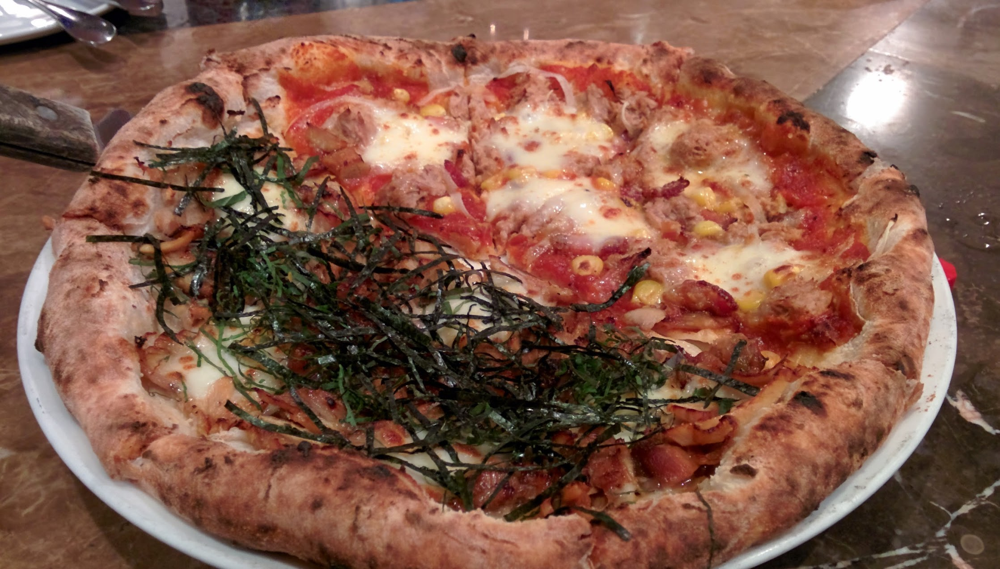
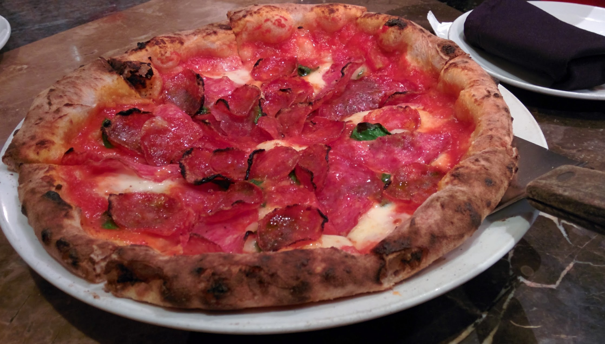
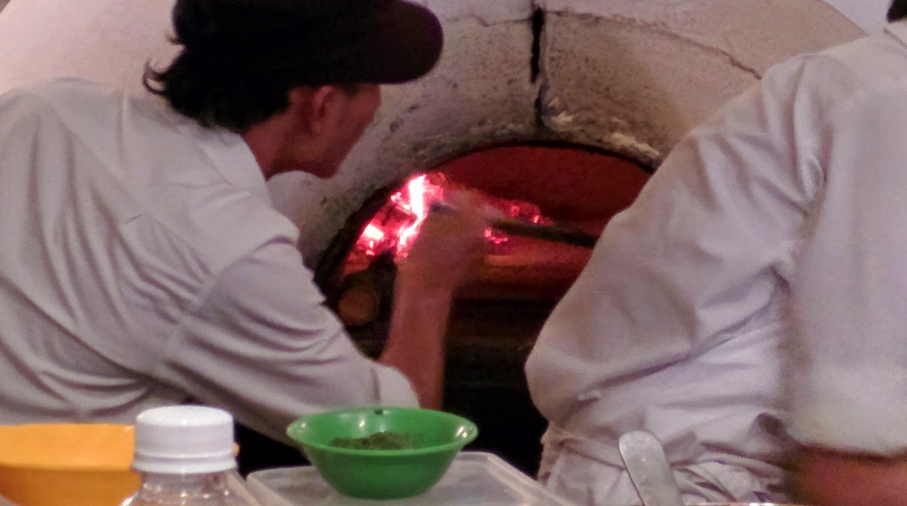
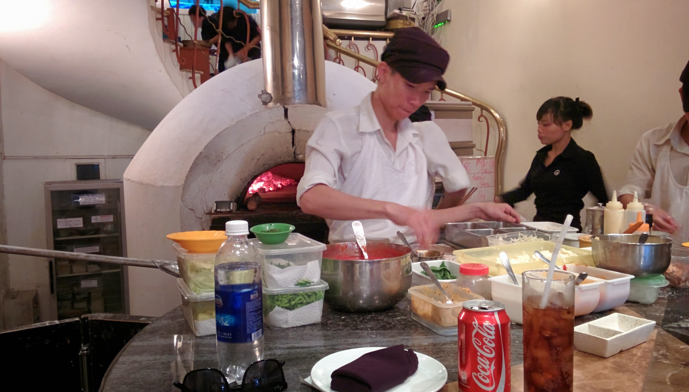

Recommended by our hosts, Pizza 4P’s  is undoubtedly the best independent place I have been for pizza that is cooked in a traditional clay oven.

We ordered two pizza’s one pepperoni & salami, and half/half tuna & sweetcorn and Teriyaki Chicken. We sat at the circle bar next to the clay oven and where the pizza’s are prepared. It was great watching the chef’s prepare the pizza’s and placing them into the oven. Our first pizza came Pepperoni & Salami, the dough is light and fluffy, and there is not too much oil that saturates the bread. We devoured it! As soon as the last slice was finished our second pizza arrived, the half/half Tuna & Sweetcorn / Teriyaki Chicken, again a delicious pizza. The balance of flavours is the best I have experienced, only a few pizza places have been able to balance flavours this well.

When in Ho Chi Min City again, I will defiantly stop on by Pizza 4P’s again. My mouth waters just thinking about it.




  {{}}
  {{}}
  {{}}
  {{}}

