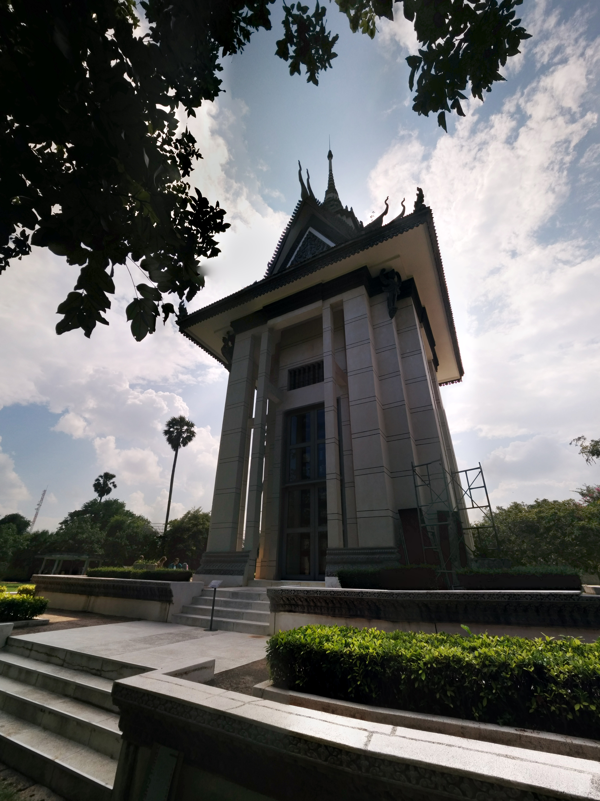
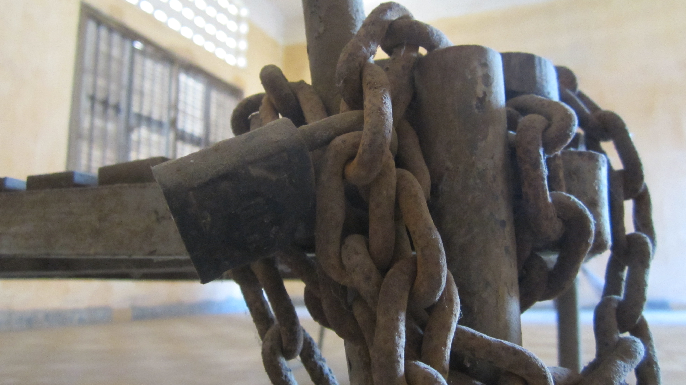
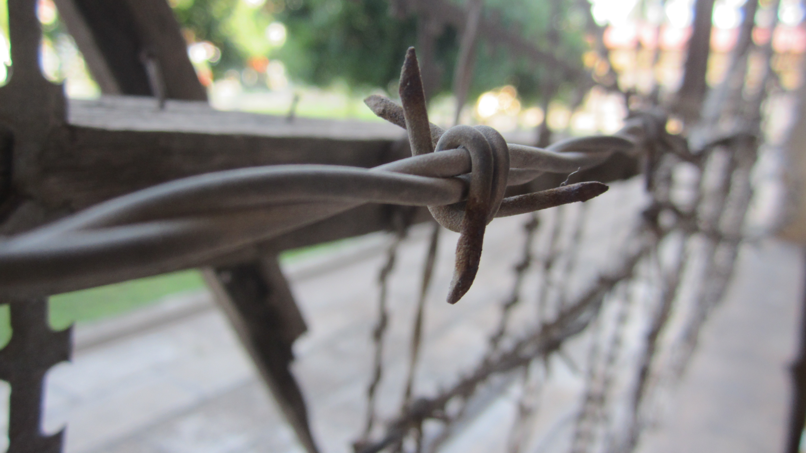
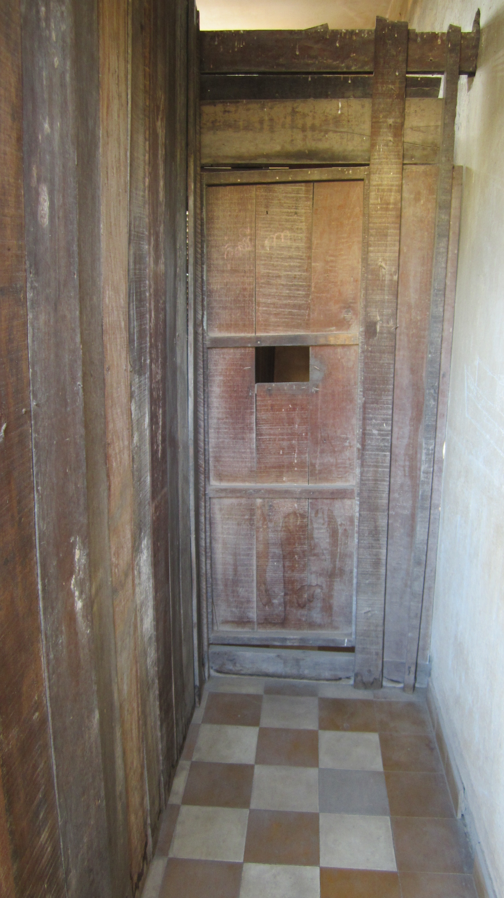
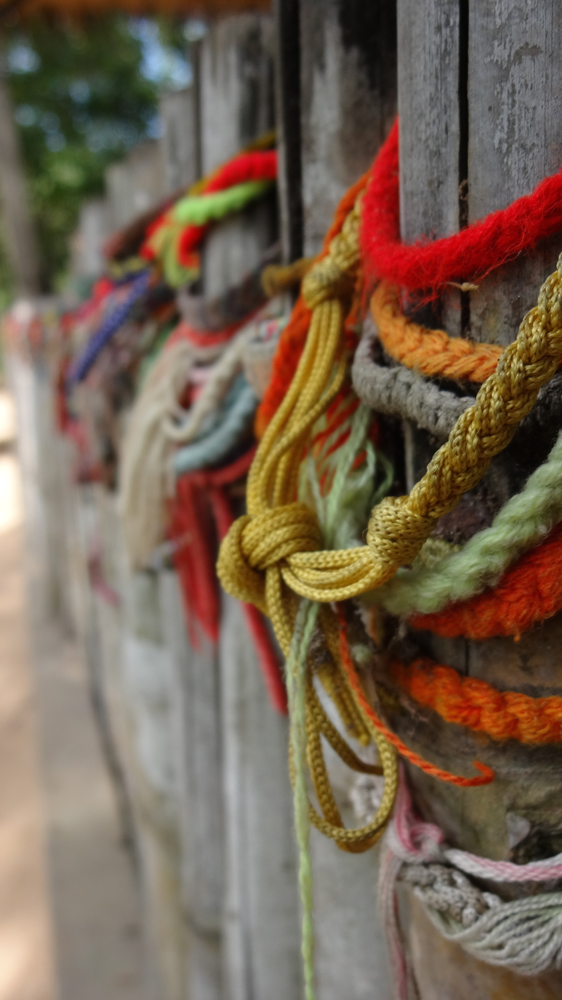
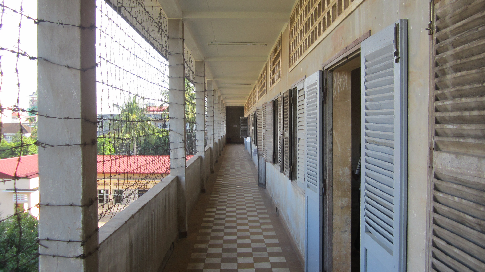
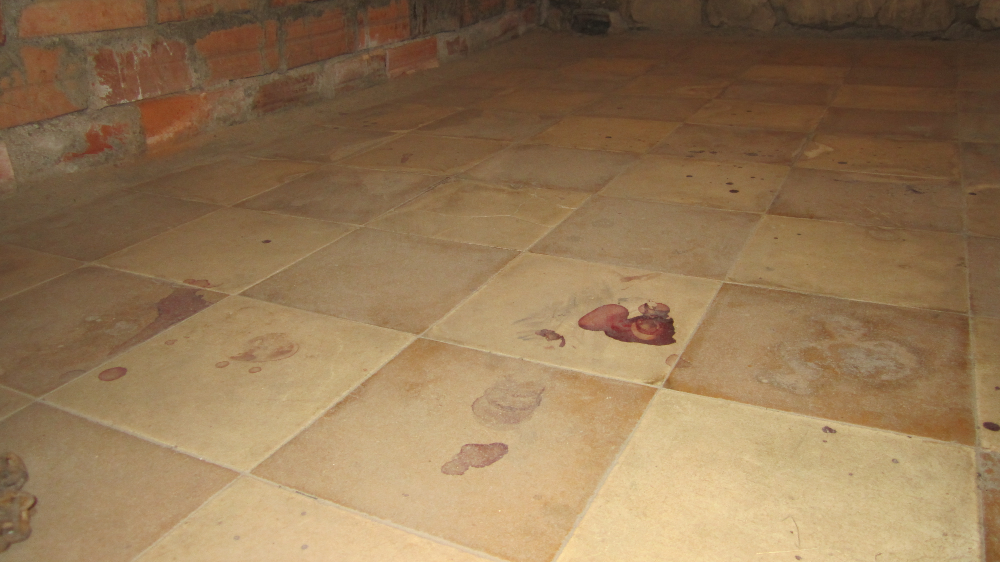

Phnom Penh the capital of Cambodia. As in many places we've travelled to, stepping off the bus we were greeted by many tuk-tuk riders asking "where you go" in hopes to get a fare.  Being savvy Kim and I decided to take the short 1.5km walk from the bus terminal to our pre-booked hotel.

After dropping our bags exploration and food comes to mind, around the corner from the hotel is The Royal Palace, at the time of visiting the immediate roads around the palace were cordoned off disallowing any motorised vehicles from coming close to the palace, this made for a peaceful walk around the perimeter.

We found a couple of coffee shops, banks, restaurants and tuk-tuk riders, along the riverfront. Before anything I needed to get some money from an ATM and get some food.  Sadly my Credit Card did not want to withdraw any money but Kim's did, so followed a coffee and a long phone call to my card issuer to find out why, long story short "try a different ATM".

While walking the streets nearly every tuk-tuk rider will stop and ask "tuk-tuk" hoping this poor traveller will forget he has legs and can not walk anywhere or explore without a rider.  My polite "thanks but no thanks" decline soon turned into "no" then later ignoring and continuing to walking past.

I don't know exactly what it was but there was something about this city I just did not like it here, maybe it was a bit more expensive than we anticipated or that there was not really that much we really wanted to do here. We did however find a cheaper hotel to stay in to bring our budget back in-line and learn about Cambodia's history at Choeung Ek (a.k.a The Killing Fields), and Tuol Sleng Genocide Museum as they were highly rated on TripAdvisor.  I honestly did not know what I was about to learn but by the end the day extremely shocked at how devastating the recent history of Cambodia.

I new nothing of the Kremer Rogue, being me, I innocently pictured Moulin Rogue at Montmartre Hill in Paris, France. How I was so wrong...  Kremer Rogue was the given name for Communist Party of Kampuchea in Cambodia led by Pol Pot. The organisation orchestrated the Cambodian genocide which forced Cambodian people out from the cities, to obey to a new rule or be killed by the Cambodian people. The cities where ghost cities, empty of people. This was as recent as 1970's in the wake of the Vietnam war. The genocide killed over 2 million Cambodians, nearly removing all native traditions and history of the people of Cambodia, it is now hard to find truly authentic traditional foods and crafts. There is plenty more detailed history on the [Kremer Rouge Wikipedia page](https://en.wikipedia.org/wiki/Khmer_Rouge).

Choeung Ek is one of many Killing Fields is one of many locations around Cambodia that were designated as mass grave sites where Men, Woman, Children would be killed and berried in open graves. Choeung Ek is now a memorial site with a tall Buddhist Stupa which homes the many skulls and bones that have surfaced from the graves.

I would encourage anybody visiting Cambodia to visit this site, entry includes an audio guide that walks you around the site telling you the history of what happened here.  You'll see many large pits where millions of people are still berried, over time clothing and bone fragments come to surface.  This is truly a moving place.

Along with Choeung Ek, Tuol Sleng Genocide Museum closes the story with unforgettable effect of the pain the Cambodian people endured. Tuol Sleng is a former school that was converted into make shift prison cells where people would be identified, detained, and tortured.  -  The detention and torture is far worse than what You or I would have ever imagined at School.

The history lesson of the Kremer Rouge is one that will forever stick with me.

  {{}}
  {{}}
  {{}}
  {{}}
  {{}}
  {{}}
  {{}}
  {{}}


There was no need to stay in Phnom Penh for any longer, we swiftly moved on to Siem Reap.
