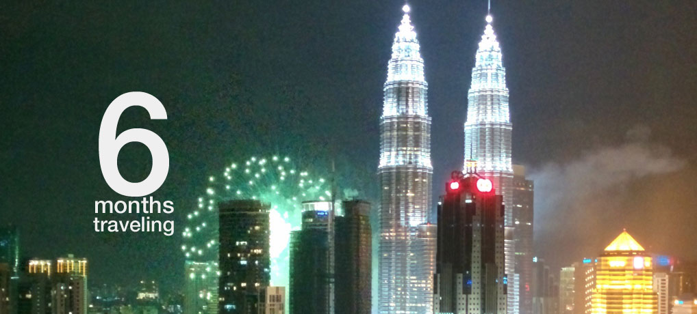

It's such an alien feeling spending the holiday season over 10,000km (6,600 miles) away from my family. Actually this would have been the first Christmas I spent not dancing with Turkey and feasting on gorgeous food. However far I go I always think of home, I may not Skype that often as I would like to but it is nice to hear my mom, and dogs are still doing well, I do worry about my step dad Gary though.

A little over 6 months ago in July Kim and I left the comforts of Great Britain and arrived in Katmandu, Nepal. This is my first time outside of the European Union. We set a challenged to visit as many counties in Asia, and now we are on on country #6 - Malaysia.

1. [Nepal](/category/destinations/nepal/)
2. [India](/category/destinations/india)
3. [Vietnam](/category/destinations/vietnam)
4. [Cambodia](/category/destinations/cambodia)
5. [Thailand](/category/destinations/thailand)
6. [Malaysia](/category/destinations/malaysia)

I maintained good coverage and documented my travels, hotels and food until Cambodia, where it has since been a hindrance maintaining the blogging momentum. Getting into the mood to write has been difficult to get into - _as I'm writing this its 04:00 am and I've had difficulty sleeping for the last few days_.

I do intend to flex my memory muscles and back track events from Cambodia and Thailand.

Anyway I wanted to show you some highlights from the last six months of travel. I hope you enjoy.

\[gallery type="rectangular" ids="132,174,194,212,243,300,308,333,381,410,424,503,546,577,721,853,895,949,1045,1127,1173,1228,1306,1308,1381,1383,1399,1403,1407,1414,1429,1443,1523,1564,1606,1607,1611,1613,1614,1615,1616,1617,1618,1619,1620,1621,1622,1623,1624,1625,1626,1627,1628,1629,1630,1631,1632,1633,1637,1636"\]
