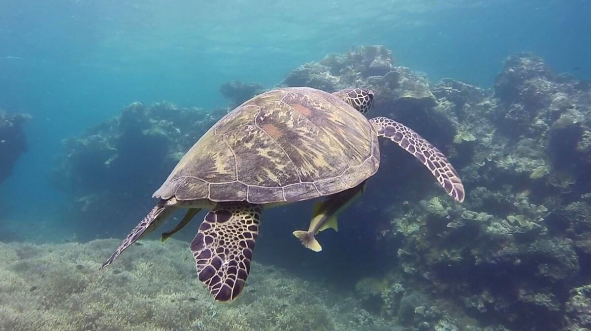

Most people will tell me "the Philippines is a fantastic place for scuba diving" and since I have my open water scuba certifications I have no excuse to test this statement.

Moalboal is a 3 hour local bus journey away from Cebu City _(a short journey compared to our previous bus trips)_. The fair is a little over ₱110 per person, and busses run very regularly alternating between A/C and non-A/C. When arriving at Moalboal you'll have to either walk 3km to the coast (where you actually want to be) or hire a tricycle for around ₱100. Us being the type to not uptake the first person to offer a service in exchange for money, we decided to walk. The evening sky was slowly disappearing with beautiful pink and orange hue's, and soon it was pitch-black. The walk was OK, everybody who we walked past said "hello" and waved, which is a welcome touch. I would not  recommended walking as late as we did as the traffic did have us jumping in the ditches a few times.

Eventually we made it to our [hotel](https://www.agoda.com/quo-vadis-dive-resort/hotel/cebu-ph.html?cid=1649959) we booked for about ₱2000 per night, check in was smooth and a fan cooled room was basic enough for our needs (although the room did have a bad pong to it). I'm not a easy sleeper and find anything will disturb my sleep, either it be motorcycles passing by at unholy hours or the rotating fan making my skin wriggle _like bugs are crawling on me_, I managed to get enough rest for a full day of scuba diving.

Moalboal has a wide choice of dive centres, I finally settled for Cebu Dive Centre . A quick email before arriving confirmed availability, dive times, and prices. Out of the three centres I emailed, Cebu Dive Centre has the best price and highest raking on Trip Advisor, it was a no brainer that I dive with them. On arrival everyone greets with a firm handshake and states "You must be Kyle", _I made the correct choice of centres_. Service was prompt, professional and more importantly friendly. Cameron the owner/main guy running the show checked my PADI certification online (I didn't have my divers card on me since I have not been to my home address in over 9 months) Rolly and Bro, resident dive masters prepared my equipment. As I have already dived 9 times to date I can easily instruct my desired weight, suit and flipper size. I purchased my aqua lung mask on a earlier trip which is a well worth investment, *"4 kilogram weights please"* .

The guys got my equipment ready while Cameron instantly guessed my Caribbean heritage and teased me that his Jamaican wife had made Curried Goat, Rice'n'peas for dinner. _Ya canni tease, mon_.  At this time my equipment is set and ready, brand new BCD, regulators and tanks... _wow I am impressed!_


  
  


My first dive was a shore dive with just me another open water diver and dive master Rolly. The dive centre is right on the water's edge so we got our equipment on and simply walked into the water put on our fins and swam no more than 10 metres out to where the house reef is, a sheer reef drop from 4 metres to about 40 metres. Immediately below is a massive school of sardine, must have been thousands, of not hundreds of thousands of fish closely packed together twisting and turning with one and another. We descended right through them and followed the reef wall east, eventually turning back when the first one of us reached 100bar of air, I dive with standard air mix at 200bar.

After 50 minutes and a maximum depth of 20.8 metres,  I finished on 50 bar and averaged a depth of 13.7m, according the the dive computer I hired.

 

My second dive was Tongo Point, a short boat journey away.  This time it I dived with dive master Juanito. Just the two of us budded up, another two divers joined the dive too, Cameron the shop manager and an advanced open water diver doing videography, _I'm sure I got caught on camera a few times_.

This site again packed with beautiful life, turtles, colourful angel fish, even electric clams in a small cave my dive master brought me into, these clams make a chirping sound. _I liked the little bit of technical diving , need to work a lot more on it_.

On the safety stop, a few other dive centres where descending, there can be a bit of traffic.

This dive lasted 51 minutes at a maximum depth of 20.3 meters averaging at 13.7m.  I finished on 50 bar from 210 bar again.



The third and last dive was outside Tongo and back with my first dive master buddy. I took this dive more relaxed, and watched all the beautiful small fish in coral. After 52 minutes, we surfaced, I ended with 70 bar from 210 bar at a maximum depth of 20.3m, averaging at 13.7m.

On all dives there is a great variation of colour and size of fish, coral and marine creatures.


  
  


I really enjoyed diving here purely from the chilled non-pushy atmosphere.  Would highly recommend this place if you want to see a great deal from snorkelling, uptake a fun dive or continue your scuba training. Cebu dive centre is a professional dive centre that really cares for the guests. If required they may reject divers who may have entered decompression lockout, or have the wrong dive attitude, to ensure a pleasant safe dive for everyone. It is this careful approach to detail that makes Cebu dive centre the place to visit.

Since my first visit I returned a week later with open arms,  I could not help but enjoy a few last beers with new friends before jetting off to other Boracay. _I know I will always be welcome here_.



Photo Credits: [Hankun Zhu](https://www.facebook.com/hankun.zhu)
