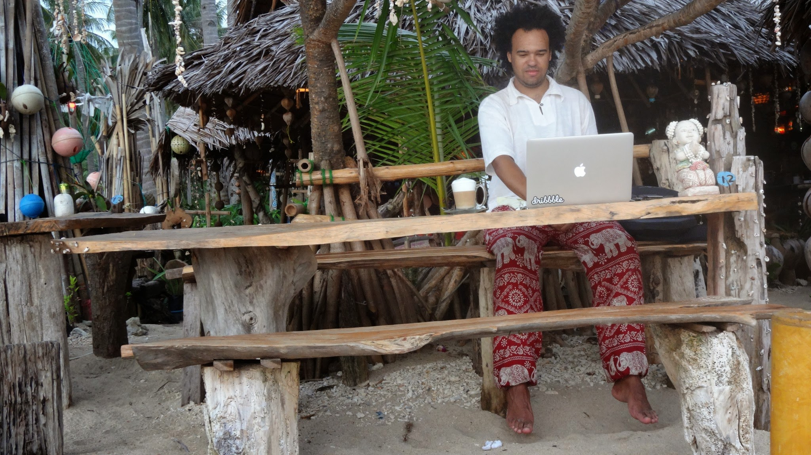

After a year of traveling and working when I can, I can conclude that the dream of working and traveling is a hard mix to get right.

Don't get me wrong, being able to earn while traveling makes the journey last longer. I have visited 13 countries in 13 months, learned how to scuba dive and experienced new ways of living.

During my travels I have factored in a good amount of 'down time' to, commit some work and relax doing, well nothing.

At the moment Kim and I are in a AirBnB apartment in Chiang Mai. This is the second time coming to this northern city in Thialand, it is cheap, comfortable and stress free:- Just like a place one can call home. We know some good places to grab a decent cuppa, indulge in tasty food and even catch a block buster movie:- yeah just like home.

What about working, well... the internet is reasonable, like a basic broadband connection. I have awesome clients that are understanding and are flexible that allows me to do what I am doing.

I have worked from, hotel rooms, restaurants, cafes, co-working spaces, and even attempted to work on a beach.

The only down side I could admit, It's not easy. My tasks are big, and I always want to do well. This has an affect on how I would spend all day inside, working. I spend weeks, not really exploring. I tend to say to people "it's either work or travel, you can't really do both and enjoy it all".

Another thing, I always want to do so much that I end up doing nothing. It's too easy to get comfortable, waking up, logging on, working, grabbing lunch, working some more and getting dinner, play some games or procrastinate then sleep. The things I want to always do is: this blog, videos, photos, finishing my books and exploring. I find myself always putting it off until later, "when I have more time", "when I'm in the mood to do it", etc.

Exhausting, right? Maybe it's time to come home to the United Kingdom and rest-up a little bit.
