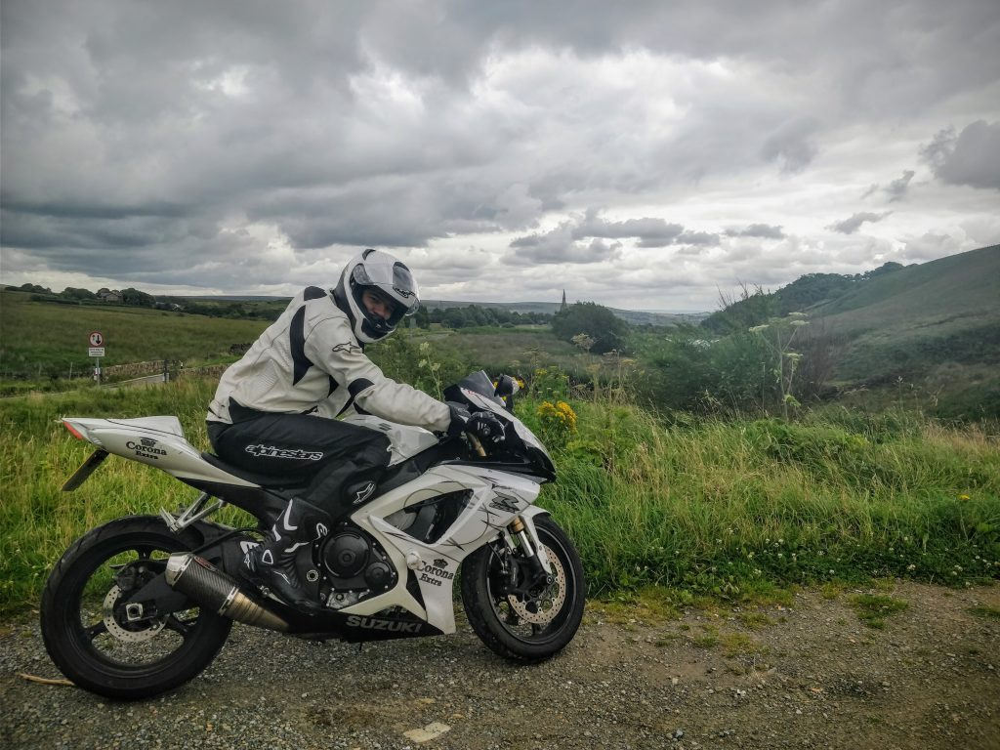

The big three-oh.  Yes, I turned thirty this year.  I told myself to get ready to do something big, scary and special to forever remember what I did during my thirtieth year.  So, while I have been back in the United Kingdom I have taken this time to Learn how to ride a Motorbike among many other activities. Learning to ride a motorbike is only one part of the preparation for a bigger part of my goal I must act before my thirtieth year is over.

In this blog, I wrote extensively about my experiences in [Nepal](http://gonetraveling.me/category/destinations/nepal/), [India](http://gonetraveling.me/category/destinations/india/), and [Vietnam](http://gonetraveling.me/category/destinations/vietnam/) before burning out from the chore of writing this I slowly reduced my documenting of my travels.  One day I might be motivated to backtrack and share some stories about this these travels.

If you've followed my [YouTube channel](https://www.youtube.com/channel/UCk6c6vGiKFwoK3436qUDQWQ), you would already know where I am going with this.



Vietnam left some impression upon me to get all my legitimate papers, knowledge on how to ride and such. (maybe it was an official in MuNe that booked me and I want to go back and with an "🖕 I have the right papers")

This year May 2017 I for my official full Motorbike license. I spent over £1,000 and a year training and then much more on Gear, and the Bike its self.

Now I spend weekends ride a Suzuki GSX-R 600 around the wonderful roads of Yorkshire Dales, Peak District, and The Lakes.  I enjoy every ride out, even if I get wet, or have a meet with a bridge.

Learning to ride the roads of my home country the United Kingdom, on a powerful bike that will not forgive me if I make a mistake.

Will either;

1. ✅ Make me to be a great rider.
2. 😱 Scare me from riding and put the brakes on my current 30th goal.
3. 💀 Seriously injure me / or worse.

**What's this goal then?** 

Before my thirtieth year is over I intend to return to Vietnam, with all the right papers, and knowledge.

My preparation goes like this;

- ✅ Learn how to ride a bike
- ✅ Get License
- Get gud
- Book flights
- Book motorbike tour guides
- Go Vietnam again

So for now, my provisional dates are the entire month of March 2018, I also intend a couple of weeks in the Philippines while over that side of the globe to revisit [my friends Scuba Diving shop](http://gonetraveling.me/moalboal-the-short-walk-out-to-open-water/).

I have a list of all upcoming and past trips on [NomadList](https://nomadlist.com/@halfcube) if you're interested in following more of my unannounced journeys.  Also be sure to follow me on [Instagram](https://www.instagram.com/halfcubeuk/) where I post more of my micro-experiences and stories there.
